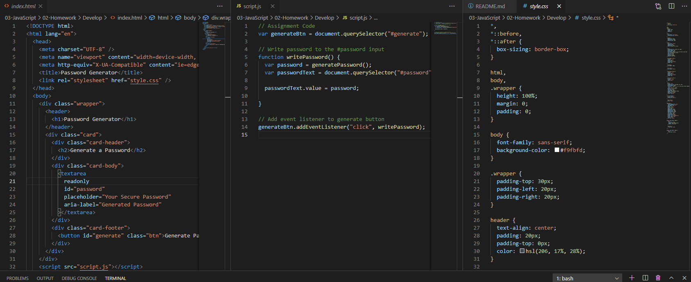
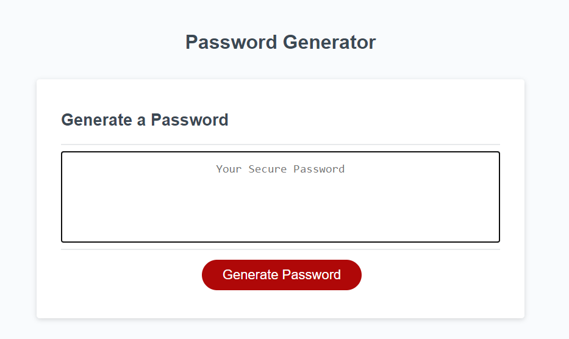
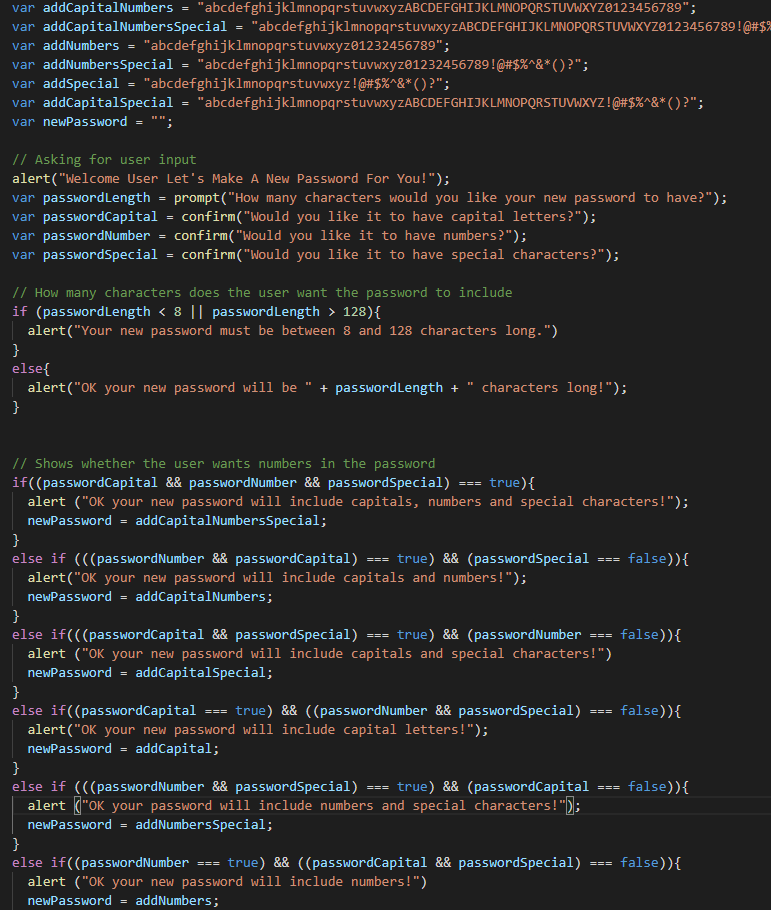
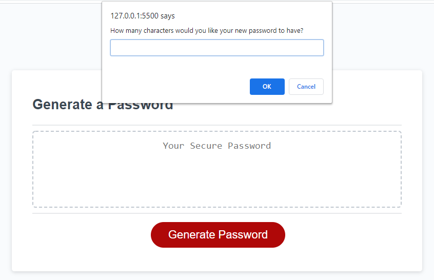
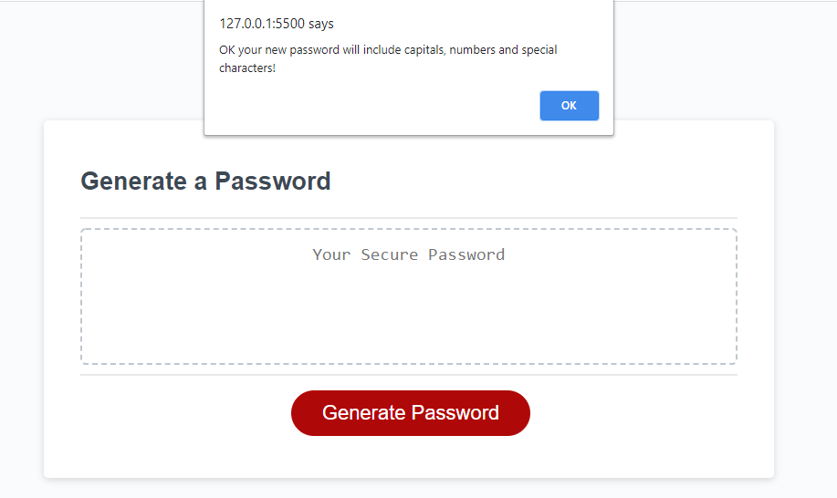
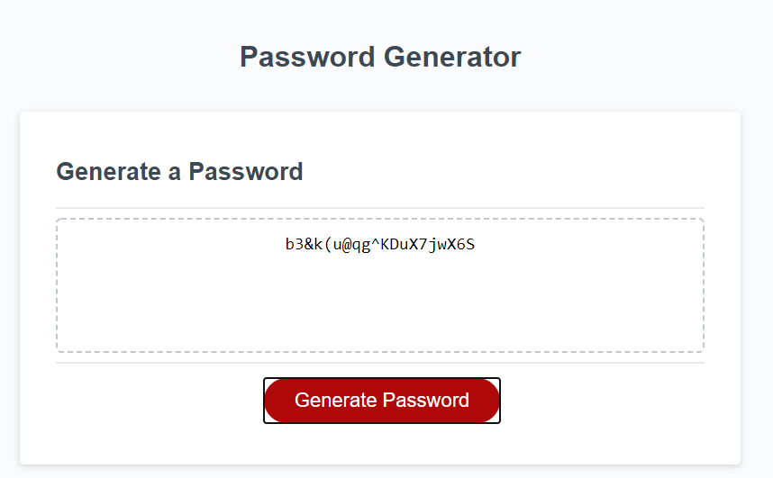

# HW3-Password-Generator

## What was the purpose of this assigment?

This week's homework required to create a JavaScript file that made our starter html page generate a new password for the user. This password would have to be different anytime the page is visited. The application asks the user a few questions regarding what kind of characters do they want included in their new password. They can choose bewteen capital letters, numbers and special characters. They can add all characters for extra security or opt out of any. However when they choose the latter a warning message shows telling the user it is a weak password with no added security.

## What did I use to make this happen?

To make my js file do what was intended, I went and pre planned what I thought would be my best path. I started by setting my variables for the different possible scenarios. Then, I included the series of prompt pop ups what depending on user input would set value to the prompt variables. Using the data input of the user I added a series of conditionals which will determine the type of characters that will be used in the new generated password. Then a function is used to create the new password at random everytime the "Generate Password" button is clicked.

## What did I get out of this assigment?

The biggest thing I got out of this assigment was the use of conditonals, variable setting and variable calling. Also the use of different operators and boolean values.

## What can I improve on?

I feel that my understanding of functions and loops needs to grow. Even though I was able to make this file work with the help of online research, I am aware that those to subjects need more of my attention to fully understand their use therefor making it easier for myself to implement them into my files without online searching.

## Given code and Mock-up page

## End result after adding JS file

[GitHub:] https://github.com/Milan1422/HW3-Password-Generator
[GItHubPages:] https://milan1422.github.io/HW3-Password-Generator/.

